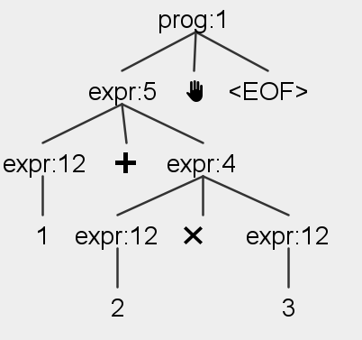
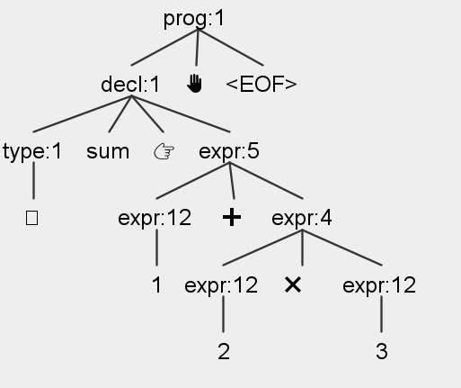

# Glyph

Hecho con ❤️ por:

- Pablo Cortés - 20.600.436-3
- Fabricha Ramírez - 20.990.386-5

Glyph es un lenguaje de programación basado en emojis, donde las palabras clave y los tokens tradicionales son reemplazados por símbolos visuales. Diseñado para ser intuitivo y llamativo, Glyph combina una estética lúdica con una funcionalidad sólida, permitiendo manejar conceptos esenciales de programación como variables, control de flujo y funciones.

## Gramática

### Tipos

Existen cuatro tipos primitivos. A continuación se especifican los valores que pueden tomar cada uno de estos tipos:

- `int (🧮)`: números enteros que cumplan con la expresión regular `'0' | [1-9][0-9]*`. Ejemplos de valores válidos son `0`, `123`, `-333`, etc.
- `float (🛟)`: números de punto flotante, que cumplan con la expresión regular `('0' | [1-9][0-9]*) ('.' [0-9]+)?`. Ejemplos de valores válidos son `3.14`, `0.001`, `1`, etc. Fijarse que es posible asignar enteros a este tipo, no así viceversa.
- `bool (✅)`: valores binarios, que sólo pueden tomar el valor `👍` *(expresión verdadera)* o `👎` *(expresión falsa)*.
- `string (📄)`: cualquier combinación de caracteres delimitadas por el token `🧵`. Ejemplos de valores válidos son `🧵🧵`, `🧵Hola Mundo🧵`, `🧵123🧵`, etc.

### Variables

Las variables se declaran de la siguiente manera:

`tipo-variable id-variable 👉 valor-variable ✋`, donde:


- `tipo-variable` puede ser uno de los cuatros tipos primitivos: *int* (🧮), *float* (🛟), *bool* (✅) o *string* (📄).
- `id-variable` es cualquier string que cumpla con la expresión regular `[a-z][a-zA-Z0-9_]*`.
- `👉` es el operador de asignación.
- `valor-variable` es el valor acorde al tipo de dato.
- `✋` es el token de fin de sentencia.

Ejemplos de declaraciones son:

```
🧮 sum 👉 0 ✋
🛟 pi 👉 3.14 ✋
✅ isPrime 👉 👎 ✋
📄 greeting 👉 🧵Hola Mundo🧵 ✋
```

Por supuesto, también se pueden reasignar las variables de la siguiente manera:

`id-variable 👉 nuevo-valor ✋`. Por ejemplo:

```
🧮 sum 👉 0 ✋
sum 👉 1 ✋
```

Cabe destacar que no es posible reasignar un valor con un tipo distinto al declarado. El siguiente ejemplo arrojará un error de tipos incompatibles:

```
🧮 sum 👉 0 ✋
sum 👉 1.0 ✋ 💭 No es posible asignar un float a int
```

> *Nota:* El emoji 💭 es usado para escribir comentarios. Cualquier caracter escrito hasta un salto de línea será ignorado por el compilador.

### Operadores

Las operaciones permitidas son:

- Aritméticas: *suma* (➕), *resta* (➖), *multiplicación* (✖️), *división (➗)* y *módulo* (🪙).

```
1 ➕ 2 ✋ 💭 3
3 ➖ 2 ✋ 💭 1
2 ✖️ 3 ✋ 💭 6
6 ➗ 2 ✋ 💭 3
5 🪙 2 ✋ 💭 1
```

- Lógicas: *and* (🤝), *or* (🤷) y *not* (🙅).

```
👍 🤝 👎 ✋ 💭 👎
👍 🤷 👎 ✋ 💭 👍
🙅 👎 ✋ 💭 👍
```

- Relacionales: *igual* (🟰), *distinto* (🚫), *mayor* (▶️), *menor* (◀️), *mayor o igual* (⏩) y *menor o igual* (⏪).

```
1 🟰 1 ✋ 💭 👍
1 🚫 1 ✋ 💭 👎
1 ▶️ 1 ✋ 💭 👎
0 ◀️ 1 ✋ 💭 👍
1 ⏩ 1 ✋ 💭 👍
0 ⏪ 1 ✋ 💭 👍
```

El resultado de las operaciones puede ser asignado a una variable:

```
🧮 sum 👉 1 ➕ 2 ✋
✅ areEqual 👉 1 🟰 1 ✋
```

### Control de flujo

#### If-else

Un bloque *if-else* se define de la siguiente manera:

```
🤔 🧎‍➡️expresión-booleana🧎
🏃‍➡️
    instrucción-if-1 ✋
    instrucción-if-2 ✋
    ...
🏃 👇 🏃‍➡️
    instrucción-else-1 ✋
    instrucción-else-2 ✋
    ...
🏃
```
Donde:

- `🤔` es la keyword que indica el inicio de un bloque *if*.
- `🧎‍➡️` es el token de apertura de la expresión booleana.
- `expresión-booleana` es cualquier expresión que devuelva un valor booleano.
- `🧎` es el token de cierre de la expresión booleana.
- `🏃‍➡️` es el token de apertura del bloque de instrucciones.
- `🏃` es el token de cierre del bloque de instrucciones.
- `instrucción-if-i` son las instrucciones que se ejecutan si la expresión es verdadera.
- `👇` es la keyword *opcional* que indica el inicio de un bloque *else*.
- `instrucción-else-i` son las instrucciones que se ejecutan si la expresión es falsa.

Ejemplo:

```
🧮 num 👉 3 ✋
🤔 🧎‍➡️num 🪙 2 🟰 0🧎
🏃‍➡️
    🖨️🧎‍➡️🧵Es par🧵🧎✋
🏃 👇 🏃‍➡️
    🖨️🧎‍➡️🧵Es impar🧵🧎✋
🏃
```
> *Nota:* La keyword `🖨️` permite mostrar expresiones por consola.

#### While-loop

Un bloque *while* se define de la siguiente manera:

```
🌀 🧎‍➡️expresión-booleana🧎
🏃‍➡️
    instrucción-1 ✋
    instrucción-2 ✋
    ...
🏃
```
Donde:

- `🌀` es la keyword que indica el inicio de un bloque *while*.

Ejemplo:

```
🧮 num 👉 0 ✋
🌀 🧎‍➡️num 🚫 10🧎
🏃‍➡️
    🖨️🧎‍➡️num🧎✋
    num 👉 num ➕ 1 ✋
🏃
```

#### For-loop

Un bloque *for* se define de la siguiente manera:

```
🔁 🧎‍➡️variable 👉 inicio ➡️ fin 👟 paso🧎
🏃‍➡️
    instrucción-1 ✋
    instrucción-2 ✋
    ...
🏃
```
Donde:

- `🔁` es la keyword que indica el inicio de un bloque *for*.
- `variable` es el identificador de la variable que se utilizará en el ciclo.
- `inicio` es el valor inicial de la variable.
- `➡️` simplemente indica que se está definiendo el rango de la variable.
- `fin` es el valor final de la variable.
- `👟` es un token *opcional* que indica la cantidad de pasos del ciclo.
- `paso` es la cantidad de pasos que se incrementará la variable en cada iteración.

Ejemplo:
```
🔁 🧎‍➡️i 👉 0 ➡️ 10 👟 2🧎
🏃‍➡️
    🖨️🧎‍➡️i🧎✋
🏃
```

### Funciones

Las funciones se definen de la siguiente manera:

```
🍿 nombre-función 🧎‍➡️tipo-1 var-1🔸 tipo-2 var-2🧎
🏃‍➡️
    instrucción-1 ✋
    instrucción-2 ✋
    ...
    ↩️ expresión ✋
🏃
```
Donde:

- `🍿` es la keyword que indica el inicio de una función.
- `nombre-función` es el identificador de la función.
- `tipo-i` es el tipo de dato del parámetro *opcional*.
- `var-i` es el identificador del parámetro *opcional*.
- `🔸` es el token que separa los parámetros.
- `↩️` es la keyword que indica el retorno de la función.

Ejemplo:
```
🍿 isEven 🧎‍➡️🧮 num🧎
🏃‍➡️
    ↩️ num 🪙 2 🟰 0 ✋
🏃
```

Una vez definidas las funciones, se pueden llamar de la siguiente manera:

`nombre-función🧎‍➡️var-1🔸 var-2🧎✋`.

## Compilador

El compilador de Glyph fue implementado utilizando [ANTLR4](https://www.antlr.org/index.html). ANTLR4 es una herramienta que permite generar parsers a partir de gramáticas definidas en un archivo de texto.

La ventaja de usar ANTLR4 es que permite definir tanto los tokens como la gramática en un sólo archivo, generando un parser y un lexer en el lenguaje de programación deseado. En este caso, se utilizó Java para implementar el compilador.

### Tokens

Cada una de las keywords y símbolos utilizados, así como las reglas de nombre de identificadores fueron definidos como tokens en el archivo `Expr.g4`. A continuación se muestra un extracto de los tokens definidos:

```antlr
SEMICOLON: '✋';
COMMA: '🔸';
ASSIGN: '👉';
NOT: '🙅';
AND: '🤝';
OR: '🤷';

INT: '0' | [1-9][0-9]*;
FLOAT: ('0' | [1-9][0-9]*) ('.' [0-9]+)?;
ID: [a-z][a-zA-Z0-9_]*;
```

Para ver la totalidad de los tokens definidos, acceder al archivo [Expr.g4](src/antlr/Expr.g4).

### Producciones

Las producciones de la gramática fueron definidas en el mismo archivo `Expr.g4`. A continuación se muestra un extracto de las producciones definidas:

```antlr
decl: type ID ASSIGN expr # Declaration;

type: INT_TYPE | FLOAT_TYPE | BOOL_TYPE | STR_TYPE;

cond:
	IF LPAREN expr RPAREN LCURLY block RCURLY (
		ELSE LCURLY block RCURLY
	)? # Condition;

expr:
	LPAREN expr RPAREN # Parens
	| MINUS expr # UnaryMinus
	| NOT expr # Not
	| expr (MULT | DIV | MOD) expr # MultDivMod
	| expr (PLUS | MINUS) expr # AddSub
```

El orden de las producciones es importante, ya que ANTLR4 intentará hacer *match* con la primera producción que coincida con la entrada. De esta manera, es posible definir la jerarquía de las operaciones y las reglas de precedencia.

A continuación se muestra el árbol de parseo generado por ANTLR4 para la expresión `1 ➕ 2 ✖️ 3 ✋`:



Para ver la totalidad de las producciones definidas, acceder al archivo [Expr.g4](src/antlr/Expr.g4).

### Implementación

ANTLR4 genera una clase `antlr.ExprBaseVisitor` que permite visitar cada uno de los nodos del árbol de parseo. Esta clase genera un método `visit` para cada una de las producciones definidas en el archivo `Expr.g4`. Por ejemplo, para la producción `expr` en el ejemplo anterior, se usarían los métodos `visitAddSub` y `visitMultDivMod`.

Sin embargo, estos métodos no están implementados por defecto. Por lo tanto, es necesario extender la clase `antlr.ExprBaseVisitor` e implementar los métodos necesarios para cada producción.

Para ejemplificar el proceso, se usará el siguiente código de ejemplo:

```
🧮 sum 👉 1 ➕ 2 ✖️ 3 ✋
```

Esta expresión generará el siguiente arbol de parseo:



La idea es simple: crear una clase por cada producción definida, y crear instancias de estas clases por cada visita a un nodo del árbol de parseo. De esta manera, es posible realizar acciones específicas para cada nodo del árbol.

La raíz del árbol se trata de manera especial, ya que es el punto de entrada del programa. Por lo tanto, se debe implementar un método `visitProgram` como primer paso.

```java
public class AntlrToProgram extends ExprBaseVisitor<Program> {

	@Override
	public Program visitProgram(ProgramContext ctx) {
		Program prog = new Program();

		AntlrToExpression exprVisitor = new AntlrToExpression();

		for (int i = 0; i < ctx.getChildCount() - 1; i++) {
			ParseTree child = ctx.getChild(i);

			if (child.getText().equals(Keyword.SEMICOLON)) {
				continue;
			}

			prog.addExpression(exprVisitor.visit(ctx.getChild(i)));
		}

		return prog;
	}
}
```

Primero se crea una instancia de la clase `Program` que contendrá todas las expresiones del programa. Luego, se crea una instancia de la clase `AntlrToExpression` que se encargará de visitar cada una de las expresiones del programa. Finalmente, se recorren todos los nodos del árbol de parseo y se agregan las expresiones al objeto `prog`.

En este ejemplo en particular, sólo se visitará el nodo `decl` ya que los otros dos nodos corresponden al token `SEMICOLON`, el cual no hace nada, y el nodo indicando el fin del programa.

La clase `AntlrToExpression` es la encargada de visitar cada una de las expresiones del programa y devolver un objeto `Expression` correspondiente. Cuando se visita el nodo `decl`, se crea una instancia de la clase `VariableDeclaration` y se maneja de manera correspondiente.

```java
public class VariableDeclaration extends Expression {
	public String id;
	public String type;
	public Expression expr;

	public VariableDeclaration(String id, String type, Expression expr) {
		this.id = id;
		this.type = type;
		this.expr = expr;
	}
}
```

```java
public class AntlrToExpression extends ExprBaseVisitor<Expression> {

    @Override
    public Expression visitDeclaration(DeclarationContext ctx) {
        String id = ctx.ID().getText();
        String type = ctx.type().getText();
        Expression expr = visit(ctx.expr());

        return new VariableDeclaration(id, type, expr);
    }
}   
```

Este mismo patrón se repite para cada uno de los nodos del árbol de parseo. Al finalizar el método `visitProgram`, se tendrá un objeto `Program` con todas las expresiones del programa.

Por último, se necesita una clase para poder procesar todas las expresiones del programa. Esta clase se encargará de visitar cada una de las expresiones y ejecutar las acciones correspondientes. Podría decirse que esta clase, llamada `ExpressionProcessor.java`, es la que contiene toda la lógica del compilador.

En el programa de ejemplo, se tendrían las expresiones `VariableDeclaration`, `AddSub`, `MultDivMod` e `Int`. Es la clase `ExpressionProcessor` la encargada de revisar que el programa no tenga errores semánticos. Por ejemplo, que la variable `sum` no haya sido declarada previamente, que el resultado de la operación aritmética sea del tipo correcto, etc.

Finalmente, el último paso es crear la clase `Main.java` que se encargará de leer el archivo de entrada, generar el árbol de parseo y ejecutar el programa.

## Ejemplos

### FizzBuzz

Imprime los números del 1 al 100, pero para múltiplos de 3 imprime **Fizz**, para múltiplos de 5 imprime **Buzz** y para números que son múltiplos de 3 y 5, imprime **FizzBuzz**.

```
🍿 fizzbuzz🧎‍➡️🧮 n🧎
🏃‍➡️
    🤔 🧎‍➡️n 🪙 15 🟰 0🧎
    🏃‍➡️
        ↩️ 🧵FizzBuzz🧵 ✋
    🏃
    🤔 🧎‍➡️n 🪙 3 🟰 0🧎
    🏃‍➡️
        ↩️ 🧵Fizz🧵 ✋
    🏃
    🤔 🧎‍➡️n 🪙 5 🟰 0🧎
    🏃‍➡️
        ↩️ 🧵Buzz🧵 ✋
    🏃
    ↩️ n ✋
🏃

🔁 🧎‍➡️i 👉 1 ➡️ 100🧎
🏃‍➡️
    🖨️🧎‍➡️fizzbuzz🧎‍➡️i🧎🧎 ✋
🏃
```

### Fibonacci

Imprime los primeros 20 números de la secuencia de Fibonacci.

```
🧮 first 👉 0 ✋
🧮 second 👉 1 ✋

🔁 🧎‍➡️i 👉 1 ➡️ 20🧎
🏃‍➡️
    🖨️🧎‍➡️first🧎 ✋
    🧮 next 👉 first ➕ second ✋
    first 👉 second ✋
    second 👉 next ✋
🏃
```

### Primos

Imprime los números primos del 1 al 100.

```
🍿 isPrime🧎‍➡️🧮 n🧎
🏃‍➡️
    🤔 🧎‍➡️n ◀️ 2🧎 🏃‍➡️
        ↩️ 👎 ✋
    🏃
    🔁 🧎‍➡️i 👉 2 ➡️ n ➖ 1🧎 🏃‍➡️
        🤔 🧎‍➡️n 🪙 i 🟰 0🧎 🏃‍➡️
            ↩️ 👎 ✋
        🏃
    🏃
    ↩️ 👍 ✋
🏃

🔁 🧎‍➡️i 👉 1 ➡️ 100🧎 🏃‍➡️
    🤔 🧎‍➡️isPrime🧎‍➡️i🧎🧎 🏃‍➡️
        🖨️🧎‍➡️i🧎 ✋
    🏃
🏃
```

### Primos 2

Imprime los primeros 100 números primos.

```
🍿 isPrime🧎‍➡️🧮 n🧎
🏃‍➡️
    🤔 🧎‍➡️n ◀️ 2🧎 🏃‍➡️
        ↩️ 👎 ✋
    🏃
    🔁 🧎‍➡️i 👉 2 ➡️ n ➖ 1🧎 🏃‍➡️
        🤔 🧎‍➡️n 🪙 i 🟰 0🧎 🏃‍➡️
            ↩️ 👎 ✋
        🏃
    🏃
    ↩️ 👍 ✋
🏃

🧮 count 👉 0 ✋
🧮 number 👉 1 ✋

🌀 🧎‍➡️count ◀️ 100🧎 🏃‍➡️
    🤔 🧎‍➡️isPrime🧎‍➡️number🧎🧎 🏃‍➡️
        🖨️🧎‍➡️number🧎 ✋
        count 👉 count ➕ 1 ✋
    🏃
    number 👉 number ➕ 1 ✋
🏃
```

## Testing

El compilador se encuentra alojado en Replit, por lo que es posible probar los ejemplos o crear nuevos scripts sin tener que instalar nada. Para ello, accede al siguiente [enlace](https://replit.com/@Blopa11/glyph-compiler).

Para compilar un programa, se necesita ejecutar el siguiente comando en la shell:

```bash
java -jar glyph.jar <nombre-archivo>
```
